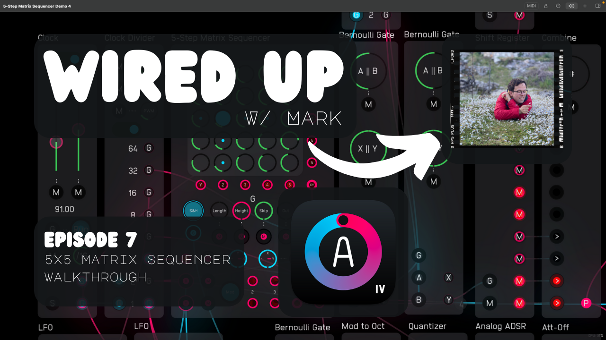
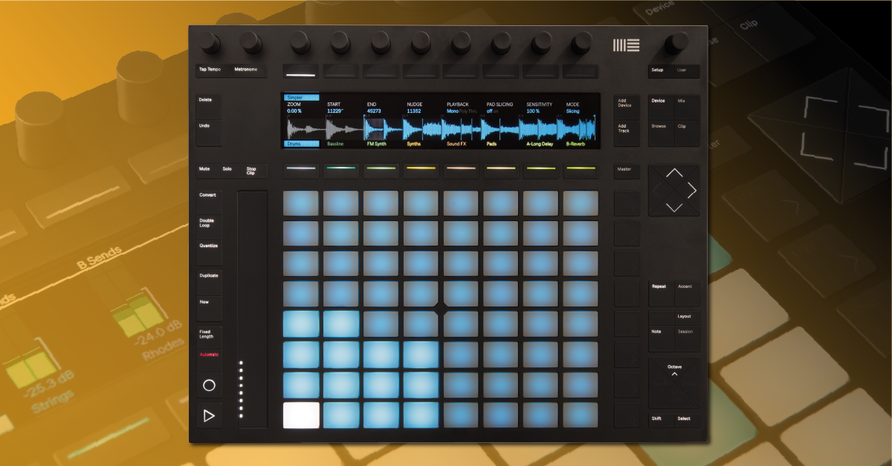
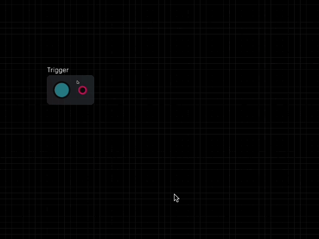
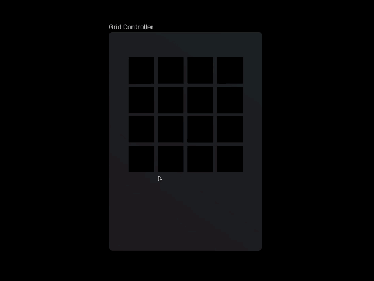
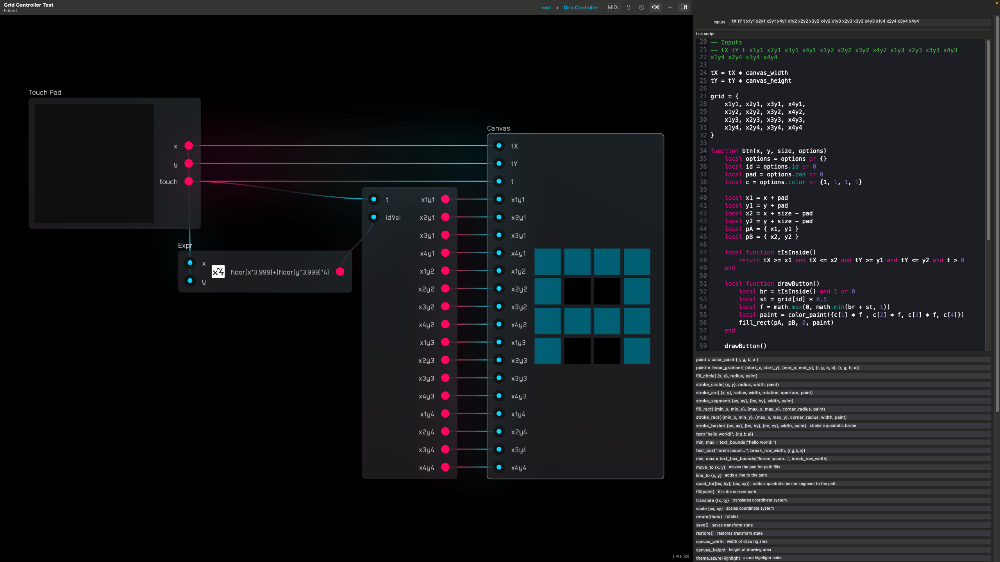
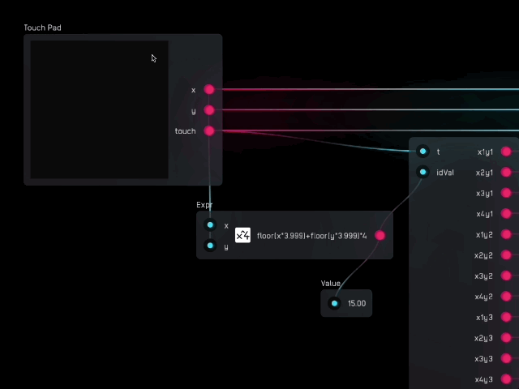
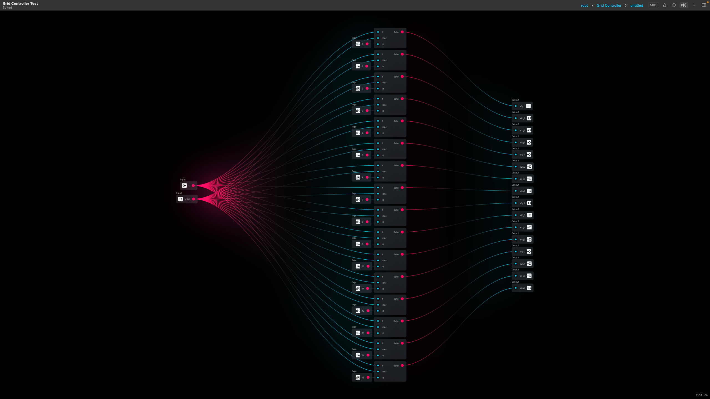
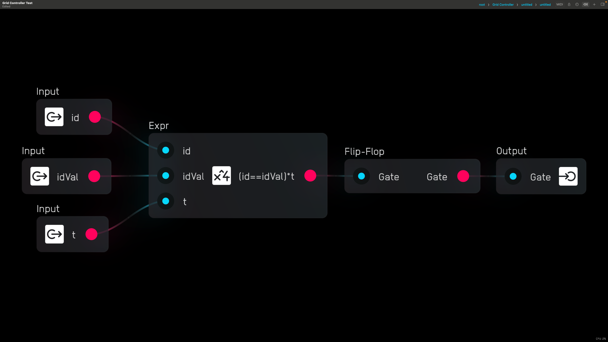

# Declarative Digital Instrument GUIs with Lua in Audulus - Part 1: Grid Controller

## Intro

[Audulus](http://audulus.com) is a modular synthesizer visual programming environment for Mac and iPad. You can use it to create digital instruments and MIDI controllers from scratch without coding by connecting nodes together with wires.

Audulus 4 introduced a cool new feature called the Canvas node. It allows you to draw shapes using the native graphics engine called [vger](https://github.com/audulus/vger-rs) by using [Lua](https://www.lua.org/), a fast-running scripting language.

When I was first starting to learn to code, I had an idea to create a graphics library for the Canvas node that users could copy and paste into a Canvas node to create a UI for their instrument or a visualizer that could respond dynamically to their music.

Creating these helper functions allowed me to create a really fantastic UI for a 5x5 Matrix Sequencer module which you can see in the video below.

[](https://www.youtube.com/watch?v=RZ9FWGlDOpk)

## Restarting the Project with a Grid Controller

It's been a while, though, since I worked on this library. I decided to revisit it and rewrite everything from scratch using the knowledge I've gained in the last year of learning how to program.

I began this overhaul by making a grid controller. Grid controllers are a popular tool to use when making electronic music. The buttons can do anything you want them to, but usually they trigger samples, act as a sequencer, or a type of keyboard. The Ableton Push is a great example of a grid controller.

[](https://www.ableton.com/en/push/)

In Audulus, you can make a grid controller by laying out rows and columns of Trigger nodes. This is effective, but it can be a little tedious to wire and lay out. You're also stuck with the one circular button type. The worst is when you want to add lights that respond to some information like current step - that means duplicating all this layout work and wiring.



The Canvas node allows us to do something similar, but in a more modular and customizable way. In the example below, the buttons are square and have a cool features that allows you to drag you mouse or finger along them to quickly reverse their on/off states - something you can't do with the Trigger node.



The whole UI for this controller is drawn declaratively in Lua using a higher-order tiling function that allows us to conveniently define the number of rows and columns of buttons we want.

The Trigger node packages a UI as well as its touch capability into one node. To replicate the touch functionality, we have to integrate a touch layer using the Touch Pad node.



The Touch Pad node gives us a surface to interact with using the mouse or our finger. It outputs the current 0 to 1 x,y coordinate and a touch signal that is (for our purposes here) either 0 (untouched) or 1 (touched).

The Touch Pad node doesn't keep button states itself - for that we need to construct a somewhat elaborate little array of Sample and Hold nodes. An Expr node takes in the x,y coordinate and divides up the field into 16 squares by doing a simple calculation.

```c
floor(x*3.999)+floor(y*3.999)*4
```

This calculation conceptually divides the touch grid into 16 squares by scaling the `x` and `y` inputs so that when they are summed, they output the integers 0 - 15. The code block below isn't what is literally being outputted (remember, it's just outputting an integer), but it gives a better visual representation of how it's mapping to the Touch Pad node.

```py
btn_array = [
    12, 13, 14, 15,
    8,  9,  10, 11,
    4,  5,  6,  7,
    0,  1,  2,  3
]
```

By examining the gif below you can get an even better idea of what's going on with the Expr node.



This value is taken as the `idVal` variable that we use to address the little 16-bit memory array I created to hold the state of each button. We check if `t > 0` (meaning the Touch Pad is being touched) and if `idVal` is equal to the `id` of that memory location.

Pictured below is the 16-bit memory array. On the left is where the `t` and `idVal` signals enter, and on the right are where the individual nodes' on/off states exit.



Inside each of the memory nodes is the logic I mentioned before. When the logic expression evaluates to true, the Expr node output goes from 0 to 1 and triggers the Flip-Flop there to change state from 0 to 1 or 1 to 0.



## The Grid UI Canvas Code

Now that you understand how button state is managed, you can see how the UI responds to the incoming button states and touch signals below. I will paste in the code below and then go through it line-by-line.

```lua
-- Inputs
-- tX tY t x1y1 x2y1 x3y1 x4y1 x1y2 x2y2 x3y2 x4y2 x1y3 x2y3 x3y3 x4y3 x1y4 x2y4 x3y4 x4y4

tX = tX * canvas_width
tY = tY * canvas_height

grid = {
    x1y1, x2y1, x3y1, x4y1,
    x1y2, x2y2, x3y2, x4y2,
    x1y3, x2y3, x3y3, x4y3,
    x1y4, x2y4, x3y4, x4y4
}

function btn(x, y, size, options)
    local options = options or {}
    local id = options.id or 0
    local pad = options.pad or 0
    local c = options.color or {1, 1, 1, 1}

    local x1 = x + pad
    local y1 = y + pad
    local x2 = x + size - pad
    local y2 = y + size - pad
    local pA = { x1, y1 }
    local pB = { x2, y2 }
    
    local function tIsInside()
        return tX >= x1 and tX <= x2 and tY >= y1 and tY <= y2 and t > 0
    end
   
    local function drawButton()
        local br = tIsInside() and 1 or 0
	    local st = grid[id] * 0.5
	    local f = math.max(0, math.min(br + st, 1))
	    local paint = color_paint({c[1] * f , c[2] * f, c[3] * f, c[4]})
    	fill_rect(pA, pB, 0, paint)
    end
   
    drawButton()
end


function tileFn(func, r, c)
    return function(x, y, s, o)
        for i = 0, c - 1 do
            for j = 0, r - 1 do
            	idx = j * c + i + 1
            	local options = {id = idx, pad = o.pad, color = o.color}
                func(x + i * s, y + j * s, s, options)
            end
        end
    end
end


tileBtn = tileFn(btn, 4, 4)
tileBtn(0, 0, 50, {pad=3, color=theme.azureHighlight})
```

### Global Variable Declaration

```lua
-- Inputs
-- tX tY t x1y1 x2y1 x3y1 x4y1 x1y2 x2y2 x3y2 x4y2 x1y3 x2y3 x3y3 x4y3 x1y4 x2y4 x3y4 x4y4
```

This part just notes what the inputs to the Canvas node should be called. Inputs are declared in a field in the editor of the node rather than inside the code blocks.

tX and ty are the Touch Pad's x and y coordinates, and the t variable is the touch signal. The rest of the inputs are the individual button states represented by their coordinates. 

```lua
tX = tX * canvas_width
tY = tY * canvas_height
```

This recalculates `tX` and `tY` based on the height and width of the Canvas node. `canvas_width` and `canvas_height` return this value which is set in a dialog box on the editor.

```lua
grid = {
    x1y1, x2y1, x3y1, x4y1,
    x1y2, x2y2, x3y2, x4y2,
    x1y3, x2y3, x3y3, x4y3,
    x1y4, x2y4, x3y4, x4y4
}
```

This portion packs the set of 16 variables into a table called `grid`. This is for convenience and to allow us to programmatically access each value later while we're iterating over the field.

### function btn

This function draws each button. 

```lua
function btn(x, y, size, options)
```

The `x` and `y` arguments represent the location of the bottom left corner of the square button. Since we're drawing a square, we just have one `size` parameter. `options` is a table of optional arguments that I'll explain as we go.

```lua
local options = options or {}
local id = options.id or 0
local pad = options.pad or 0
local c = options.color or {1, 1, 1, 1}
```
These lines unpack the optional arguments. Lua doesn't have optional keyword arguments like Python, but this is a way to effectively do the same thing.

While initializing these variables, you either pull from what's been passed to `options` and assign it to a local variable, or you set a default value.

The `id` value is what we'll use later in the tiling function to keep track of which button we're creating. `pad` is a padding amount around the border of the button. `c` is the color value, which in vger is a table of `{r, g, b, a}` values. It defaults to white if no color is selected.

```lua
local x1 = x + pad
local y1 = y + pad
local x2 = x + size - pad
local y2 = y + size - pad
local pA = { x1, y1 }
local pB = { x2, y2 }
```

This block calculates some local variables we need to use. We need two coordinates to pass as arguments for the built-in `fill_rect()` function later, so we're calculating them here taking padding into account. For the sake of readability in a later line, we then pack those coordinates into points `pA` and `pB`.

```lua
local function tIsInside()
    return tX >= x1 and tX <= x2 and tY >= y1 and tY <= y2 and t > 0
end
```

This is a local function we'll use to detect if the touch value is inside the button. It returns a `true` or  The `tX` and `tY` values of the Touch Pad node remain at whatever value you last touched, so we need to have an extra check at the end there that makes sure `t > 0` which means you're actually currently touching or clicking on the button.

```lua
local function drawButton()
    local br = tIsInside() and 1 or 0
    local st = grid[id] * 0.5
    local f = math.max(0, math.min(br + st, 1))
    local paint = color_paint({c[1] * f , c[2] * f, c[3] * f, c[4]})
    fill_rect(pA, pB, 0, paint)
end
```

As the name implies, this function actually draws the button itself. The `br` or brightness variable checks first if `tIsInside()` and if it is, then it's set to 1 - otherwise it's set to 0. 

`st` is the button state, which is bound to the `grid[id]` and then attenuated by half so that we still have room for the button to get brighter as it's being pushed.

`f` is the factor by which we're changing the brightness of the color, which is a clamped value of `br` and `st` added together.

We create the `paint` by indexing into the `r, g, b` values of the `c` or color variable we're getting from the `options` section and multiplying those indicies by the `f` brightness factor. `color_paint()` is a built-in that returns a `paint` type expected by the other built-ins that actually draw the shapes in vger.

Finally, we simply plug in the `pA`, `pB`, and `paint` values to the `fill_rect` function which will actually doing the drawing. The `0` you see there is for corner radius, which I'll add in the future as an optional argument.

```lua
drawButton()
```

Finally, at the end of the `btn` function, we actually call `drawButton()`.

### function tileFn

```lua
function tileFn(func, r, c)
```

This is the higher-order function that takes a function as its first argument and returns a new function that you can call that will tile that drawing function as many times as you want.

The `r` and `c` values are the number of rows and columns.

```lua
return function(x, y, s, o)
```

On this line we return an anonymous function with the same arguments as the function we're passing to it. The variables are abbreviated for brevity.

```lua
for i = 0, c - 1 do
    for j = 0, r - 1 do
        idx = j * c + i + 1
        local options = {id = idx, pad = o.pad, color = o.color}
        func(x + i * s, y + j * s, s, options)
    end
end
```

In this section, we're doing a nested `for` loop that calls the function passed to the tiler. The outside loop is for each column while the inside loop is for each row. We start at 0 and go up to but not including the total (to account for starting at 0) because for the calculations below we need to start at 0 so that the first button will be at the x, y coordinate specified.

For each button, we calculate an `idx` value which will be equal to the `id` number of the button. This mirrors to the calculation we did outside in the Expr node, except we don't need to scale and floor the numbers.

We then repack the options table and set the `id` to equal the new `idx` value we just calculated, and simply pack the rest by passing the value using the `pad = o.pad` and `color = o.color` because we don't want to change those at this step.

```lua
func(x + i * s, y + j * s, s, options)
```

Finally, in this line we call the function passed to the `tileFn` and load the `x` and `y` values with the integers we're getting from the iterator multiplied by the size parameter. We then of course pass the `s` parameter and the repacked `options` (which, note, is different from the `o` variable we declared earlier).

The inner function isn't actually called at this point because remember this is all wrapped in an anonymous function. We actually have to pass the result of this `tileFn` into a variable and then call that variable as a function to get it to work.

### Calling the Function

```lua
tileBtn = tileFn(btn, 4, 4)
tileBtn(0, 0, 50, {pad=3, color=theme.azureHighlight})
```

After defining all the functions we need, we can now call `tileFn()`, pass `btn` as one of its arguments, set the rows and columns to 4 and 4, and assign this newly created function to the variable `tileBtn`.

Now we can call `tileBtn` in an identical way to how we'd call `btn`, but this time the `x` and `y` variables represent the bottom left corner of the entire grid, not just the first button.

The result is a grid of buttons 50 units wide (with 3 units of inner padding), and a color that matches the built-in Audulus azure blue.

Their off state is black while their on state in a dimmed blue. When pressed, they jump to the full azure blue color and when released, go back down to blue or black depending on the state of the button.

## Reflections and Next Steps

While I laid it all out nicely here as if I just programmed this all from the top of my head, it actually amounted to a full day's worth of worth puzzling and reasoning over.

When you're creating your first new thing for a library, you're making a lot of decisions that will guide the rest of your development.

I'm attempting to make this library as modular as possible and as easy to use as possible so that an end-user could just be familiar with the API and essentially only need to do the last two steps where they assign and call the functions. They wouldn't need to understand how the functions work line-by-line, or even conceptually what's going on.

### To Generalize `tileFn` or Not?

I'll of course need to refactor some of this to make the `tileFn` more general, but I'm already thinking, hm, this is going to be a bigger undertaking when users want to pass triangles (and which kind of triangle!), or hexagrams, or circles.

It's a fun challenge and it's got me wondering if it'll be best to create one big mamma `tileFn` that checks the type of the function being passed to it and then alters its behavior based on that, or should I make shape-specific tilers that allow the tiler functions to be shorter?

The answer to the question is probably that I'll have to wait to get user feedback to see what's more desireable. I want this to be as easy and foolproof to use so that you really truly don't need to know anything about coding to work with this library - that you're essentially filling in parameters almost like in a graphical editing program - but there's a balance to be struck.

### Improvements to `btn`

There are several additions I want to make to the options in the `btn` function. Aesthetically, I want you to be able to round the corners and apply a border, as well as create a text label for button.

Ideally `btn` would also optionally support multistate button colors. I'm imagining you could devise a controller that responds to multiple consecutive presses, or long presses.

It would also be great if each `btn` could work like a mini touchpad itself to support MIDI Polyphonic Expression or [MPE](https://www.midi.org/specifications/midi1-specifications/mpe-midi-polyphonic-expression).

### Sky's the Limit

I plan on expanding this library until it is a very powerful tool for creating declarative UIs and music visualizers. I'm also thinking it'd be a cool way to experiment with understanding primitive 2d and 3d rendering engines.

I'm not sure many people will end up using this, if any at all, but I'm confident if you've made it this far and you're just starting out with Audulus and coding and want to build things using the Canvas node, you'll get a lot out of this series as you build along with me.